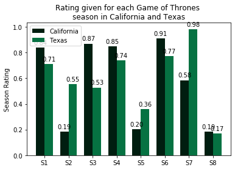
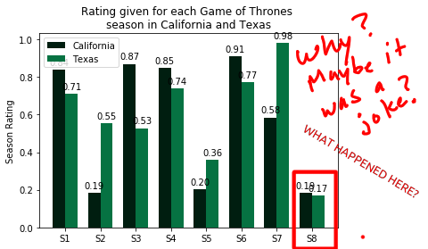
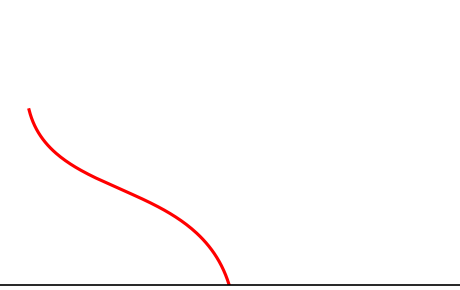
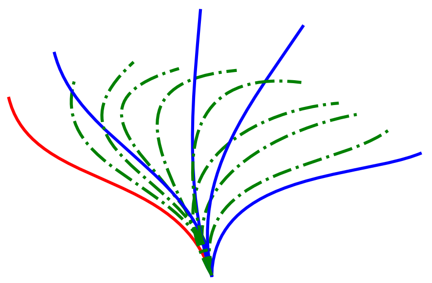

One of the most difficult aspect of research communication is finding effective graphics for your presentation, poster, or journal publication. I can spend hours on a single research image if I really need to convey a specific idea that I cannot find in free images. Alternatively, free images that I may help convey my idea misses key aspects of what I want to highlight, and may overcompensate with other aspects that are the highlight of their original idea.

In this lesson, we will cover some aspects of research images that help convey messages in different formats. We will also view some images from different researchers that are created in different programs. We leave the technical aspects of an image and specific programs used for later lessons. This lesson serves as an introduction to what type of images are used effectively in research.

## Learning Objectives

- Participants will examine the different formats of images used in research
- Participants will give an example of a statement/image pair for research articles
- Participants will develop their own research statement for image content creation

## A word about accessibility

Since I was a child, I've always wondered if the world I view is interpreted by my brain in the same fashion as others. For example, I remember being in my 2nd grade class and asking my teacher "I see green here, but what if your brain tells you that green actually is blue by my mind?". He was an older teacher, finishing his retirement by substituting long term for a friend of his, and he looked at me and replied "No" as he walked away. Now that I understand physics, the green wavelength is the same, but there is still something to be said about how I *perceive* the world and how others do. 

In either way, there are many people with hidden disabilities that prevent them from experiencing the world the same way that we do. And contrary to how my question was dismissed all those years ago, these are definitely real quantifiable differences in other's experiences.

Here are some resource when considering your images: specifically consider fonts and colors:

- Fonts
  - [Good fonts for dyslexia](https://dl.acm.org/doi/abs/10.1145/2513383.2513447) by Luz Rello, Ricardo Baeza-Yates, [pdf](http://dyslexiahelp.umich.edu/sites/default/files/good_fonts_for_dyslexia_study.pdf)
  - [Extra reading](https://bdatech.org/what-technology/typefaces-for-dyslexia/) about which fonts might be useful
- Colors
  - Some [information](http://www.colourblindawareness.org/colour-blindness/types-of-colour-blindness/) about colorblindness and some statistics
  - [Palettes](http://mkweb.bcgsc.ca/colorblind/palettes.mhtml#page-container) to use for image creation.

## What is in an "Image"?

When we describe images for research, we can be more specific in naming the types of images that are used (again, not using technical terms yet). Specifically, we use _visualization_ tools to create images, diagrams, or animations. For the purposes of this lesson, we will lump images, diagrams, and animations into one category, but within this very broad category, we make the following distinctions:

| Image                                     | Diagrams                                | Animations                                               |
| ----------------------------------------- | --------------------------------------- | -------------------------------------------------------- |
| sketches illustrations pictures | flowcharts plotting data maps | video recordings stop motion computer graphics |

Since we are lumping all of these together, we are over using the word "image" but once we are finished with all the lessons, we will see that we are not incorporating all of these into this definition. Additionally, even this table could be reworked to be a compilation of images instead of a table. How would you do this?

Typically, in our research, we use all of these different visualization categories during different presentations. For example, if we are presenting something through a static medium (journal article or poster), we might use *pictures* and *illustrations* instead of *video recordings*. Conversely, some visualizations of data, such as plotting a line graph or bar chart, will be used in both static and live presentations (such as a research talk once you defend your dissertation).

### Images

Some of my most useful images in my research presentations are found during my background descriptions because a bullet list of key topics can be less powerful than an impactful image on a single slide. **Aside**: these collections of lessons are not a complete rehashing of other presentations on "Effective PowerPoint presentation styles", or "Better creation of academic posters", but a focus on only the images that we use in these presentation mediums. Also, keep in mind that many folks give "how-to"s on better #sciCommuncation. These lessons are not focused on those topics. Moving forward!

Now, take for example the list of the following motivations for my research:

- My research is important because
  - We want to improve delivery of medication to the lung
  - Coarse particulate matter are small (less than 10 microns in diameter)\
  - Exposure to harmful particulate can be unplanned, but nonetheless harmful

Could we effectively use images to communicate this better without having to have the audience read the list above? Of course we could! The following images could be used in conjunction with a verbal description during a verbal communication of the list above, without having the audience actually read the list above. However, this does rely on an effective communication of the narrative during the presentation.

| What do you say:              | Medication delivery to the lung                              | Powders are micron sized (including bad ones)                | Bay Bridge covered in smoke during wildfires                 |
| ----------------------------- | ------------------------------------------------------------ | ------------------------------------------------------------ | ------------------------------------------------------------ |
| What you show to the audience |  |  |  |

You might then say, "Well, Carlos, there might be a problem with delivering some of this information that describes a process!" And you would be 100% correct! The process of delivery of medication into the lung could be difficult to convey with only pictures. Would we show someone inhaling some [albuterol](https://www.mayoclinic.org/drugs-supplements/albuterol-inhalation-route/description/drg-20073536) and expect the audience to know we are talking about asthma or general inhalation of medication? Instead, we could guide the audience and use some illustrations to show the process of general delivery of medication for inhalation. It could incorporate a diagram to show quantitative flow of information as well, such as time progression and scale. That is the topic of the section on [diagrams](#diagrams), but before, lets address another aspect of images: time.

Oh, well now I introduced that pesky word *time*. For many researchers, time is that unstoppable force that we must cope with on a daily basis; it prevents us or allows us to procrastinate. However, we could also use any of the image creation basics to convey information in time. Take for example, the process of delivering medication, if we used traditional animation, we would create a series of images to move forward in time to create the sequence in time we wanted to display. The beauty of creating images with the techniques you will learn here is the following: they need not be extremely fancy. Or in other words, we are not going to teach you to be an expert animator to use these tools. But the basics you will learn to create an image, could be paired with a simple 3-slide PowerPoint presentation to animate a concept very easily.

### Diagrams
For information that can be harder to divulge with a singular photographic image or an illustration. This can be due to having quantitative data, such as the following image that show the ratings of Game of Thrones seasons. The data is randomly generated, so it does not represent an actual poll or survey.

The content for these sets of lesson do not dive into making plots. There are many tools that are useful for making quantitative graphs and plots. Here are some that I have found to be useful for me (mostly for my scientific data), and definitely not comprehensive:

- Use Python and matplotlib together to generate graphs
- Bokeh if I want to get fancy in interactive plots
- VisIt and ParaView for large scientific data visualization
- ggplot for nice graphs that are quick and easy to generate
- R and Rstudio for statistical data sets

However, some of the images that are generated with these tools, and just as the image above, can be augmented with the tools we will learn to use in these lessons. While data manipulation is unethical and **under no circumstances** ever be done, highlighting aspects of this image, such as the terrible rating season 8 received, could be accomplished to point this *fact* out.

### Animations

Sometimes it may be useful to show things in movement, and this is where many research presentations that are live and dynamic may benefit from the usage of great animations. In the following example, I am showing the mathematical beat pattern from G. R. Fulford and J. R. Blake, Journal of Theoretical Biology 121, 381 (1986).

Of course this requires me to be making a dynamic presentation where I am allowed a medium to show animations. This simple GIF that I've created definitely conveys something happening in time. It is an animation that tells you "The cilium moves from the start of a beat cycle in red, with the forward stroke colored in blue, and the recovery stroke colored in green." There are many more animation tools that we will not go into detail here, as most of my animation creation relies on making GIFs from stacks of images as in the image above.

I also don't always use animations, but I instead use the [stroboscopic effect](https://en.wikipedia.org/wiki/Stroboscopic_effect) quite often. Below, I have the exact same image, and this allows me to not only create the same affect as above, but I can also use this in journal publications instead. If I wanted to be even more fancy. I would overlay the animation above this image so I have both the static and the dynamic image to make my point! This of course takes a bit more work, but depending on how complex the message is, I would take the time.

## What do I mean by an "Image"?

For the rest of my videos and lessons, I will narrow down what I mean by an "image". I use the term **Research Images** as the following:

- sketches
- illustrations
- flowcharts
- process maps

This definition allows us to develop skills with the tools for a research setting, where time is limited, and we must create images relatively quickly. These lessons are not meant to turn us into graphic designers/animators. This definition I use above encapsulates enough visualization tools for our lessons to be useful.

## Research Images

Now we will get into the weeds of our research images. I am a big proponent of reusing your own work. I do not think that you should work harder, but I **do** think you should work *smarter*. And this core philosophy means that all of the research images I use will be reused in different presentations, posters, and journal articles. However, it is known that that the journal publication sits at the top of my content creation; read as "this paper is the most permanent content I will create". As such, I spend significantly more time creating images for publication, than I do for an in-person podium talk. In fact, many universities hire professional artists and designers for these jobs.

*<u>Disclaimer:</u>* I am not a professional artist nor designer, so the information provided is through my own self-taught and user experiences as an amateur content creator.

### Examples of research images

The follow images are credited to the original authors of the journal articles by where the appear. However, it should be noted that not all (if any) are created by professional artists. There are plenty of professionals that do work diligently to create these images, and some researchers cited here create really high quality images. We point out the following for each image: 1) message of the image; 2) positive aspects of the image; 3) improvements that could be made. It should be also said that these opinions are my own, and of course, some of them do the job of conveying a message. Feel free to contact me with comments and if you disagree. I am happy to listen! 

### Look ahead: Thinking of your message

By [lesson 4](lesson-04.html) we will have explored what are the components of an image, looked at some of the tools available to create images, and we will be be ready to jump into a framework for creating your research image. In the mean time, we can begin to think about how to narrow down the scope of your image content idea by first thinking thoroughly about your message. There are several questions you can begin to ask when thinking about the message that you would like to convey, irrespective of whether you will use an image or not. While our entire lesson is not focused on crafting an *effective research message*, we can dive a little into this area.

- Is my message abstract? Can I make it less abstract?
  - Many times we can get bogged down in our own research and the details. 
  - Our message could be simplified in certain sections of our presentation or paper. 
- How important is this particular message?
  - Sometimes we think that ever word in our paper is important.
  - Readers spend little time on certain aspects, so narrowing down the importance can help craft a better message.
- Have I discussed this idea with others?
  - Having a message that is easily communicable takes practice, but it must be shared more than once.
  - Listening to other's feedback can help determine how developed an idea is.
- What part of my presentation/paper does this message belong in?
  - When writing any message, the context of the message can help determine how to improve it.
  - Drafting an outline with a context specific message could help in improving the message.
- Who is your audience?
  - This is probably the most important part of crafting your message.
  - Knowing who will be in the room or reading your paper helps you the most in determining what message you will use, and how it will be crafted.

While this list is not exhaustive, and doesn't go into the details of creating better messages, it does serve as a starting point for our image creation content. With these questions in mind, begin to think of your own research message. 

What would you like your audience to know?

## Image Credits

- "[Bay Bridge covered in Campfire smoke 2018](https://commons.wikimedia.org/wiki/File:Bay_Bridge_covered_in_Campfire_smoke_2018.jpg)" by James R Morrin Jr is licensed under [CC BY-SA 4.0](https://creativecommons.org/licenses/by-sa/4.0/deed.en)
- "[Carbon_black](https://commons.wikimedia.org/wiki/File:Carbon_black.jpg)" in the public domain
- "[Powder](https://www.flickr.com/photos/kjgarbutt/5586148921/in/photostream/)" by Kurtis Garbutt is licensed under [CC BY 2.0](https://creativecommons.org/licenses/by/2.0/)