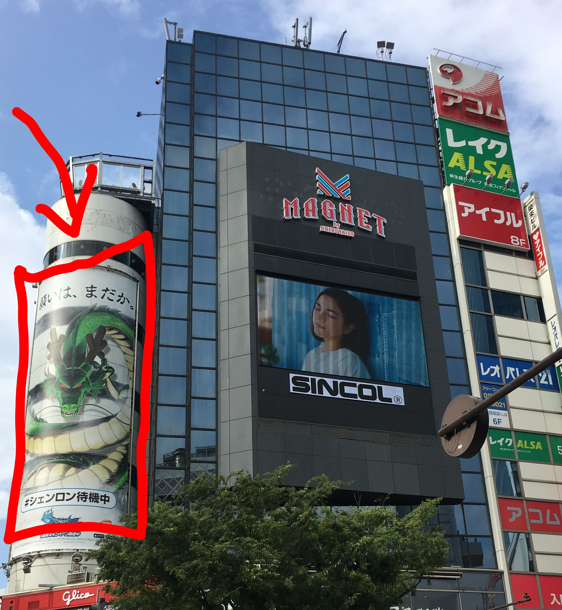
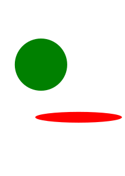
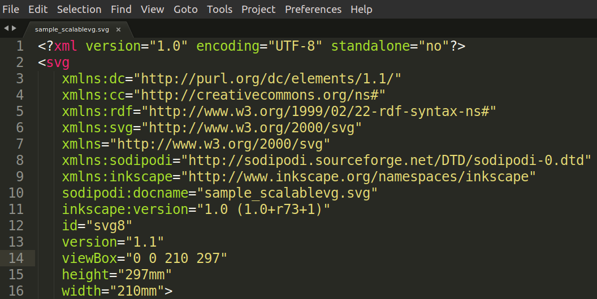
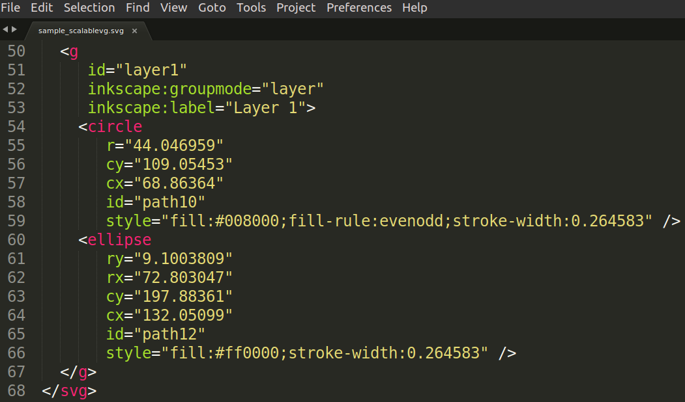
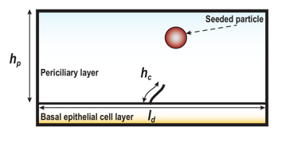
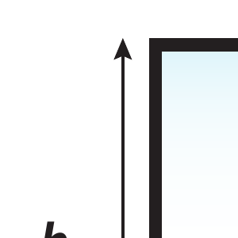
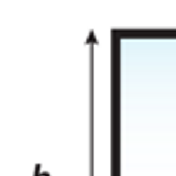

Technical aspects of image creation can be very daunting for the researcher. Specifically, I find myself having a hard time deciding on what type of image I want to use to convey, and if I have the correct resolution. While this could be important for publication of journal articles with specific imaging requirements, sometimes, the technical aspects of such an image could be mysterious. 

In this lesson, I explain the specific details of images that can help researchers make more informed choices when choosing an image. I also show some examples of images that are defined in different ways. The programs used to create these images are left for the next lesson!

## Learning Objectives

- Participants will distinguish between a raster image and a vector image
- Participants will examine the differences between high quality and low quality images
- Participants will select the appropriate file types for specific image use cases

## A tiny word on image capture

While this lesson will help us demystify the technical aspects of an image, we must begin with an overall framework with historical context for the "image". From the modern perspective of a user of the hand-held phone camera, an image is quickly recognized as the "point and click" marketing tool that popularized digital photography. This is now ubiquitous in all forms of media, including the most recent social media escapades including Facebook, Instagram, Twitter, and the newer TikTok, SnapChat, Vine. However, the technicalities of these images come from their creation:

1. A digital image is created by capturing light using a sensor array; think of a flat assembly of individual boxes measuring the light of color that is absorbed when you "point and click"
2. The camera has these sensor arrays, but then maps these signals into a matrix of pixels; again, think now of another flat assembly of individual boxes that now have a value of the color stored.
3. Each image now is either stored on the camera, displayed so you can decide to take another one, or converted into a format that is cross platform; finally, think of sharing all these values, we have to agree on the type of information that makes up the image, so that way anyone can share the image with each other.

The key aspect of sharing data, and in particular image sharing, is fundamental to computer science, so we will not make everyone understand how digital "ones and zeros" compose an image, but we will say this: images and their ability to be shared, are driven by what they are being used for. For our purposes, we will dive into the two major types of image types that we use in research.

## Digital images

As we saw in [lesson 1](lesson-01.html) previously, our images were more of visualization types, but now we talk about the technical term. In our explanation of capturing an image, we were describing how most of us are used to doing: taking images in our daily life. However, not all images that we will use in research are specifically these camera-generated images. We also create illustrations that are drawings or diagrams from our imagination. Therefore, we need to describe the two major types of image formats: the raster and the vector

### Raster Images

Plain and simple, a [raster image](https://en.wikipedia.org/wiki/Raster_graphics) is the collection of values for each individual subunit boxes that we described above for a captured image. This is also called a bitmap image. This is usually displayed by collection of pixels, which we have been calling "a collection of boxes". We will not describe in detail what a [pixel]() is, but we will show an example below. In the image, the graphic that contains a keyboard, mouse, and monitor, are made from a collection of pixels. As we zoom in to the image, we see the individual boxes that make up the image.

One major part of the bitmap image is that the matrix of information it contains cannot scale larger than the original source. This is popularized in crime/detective tv-shows where images are "enhanced" to make images that look pixelated more clear; we will talk more about pixelation below. This is not possible, although algorithms are definitely trying to recreate information that is not captured by the raster image.

For our research image creation, we must know that certain raster image formats are more popular than others. In the image above, and many other images, it has typically been converted to a cross-platform file format that compresses a lot of the image information for display. Here are some of the common formats that you very likely to know:

- jpeg, jpg
- png
- tiff

These image formats will convey one very important piece of information: you **cannot infinitely resize these images**. This is important because to reuse your images in presentations, sometimes the quality can deteriorate if you lose the original image. Now, this leads us to the next discussion about infinitely resizeable images: vector images.

### Vector Images

For those content creators that make large banners that might be printed on the side of a building, creating a logo as a raster image file above will only work if you make the original image the size of the image that is going to be printed. This means that the conversion between a printed image and the computer generated image you've made might be a bit tricky to get right. Below, we can see that the banner is an illustration, and most likely was created as a vector image.

The main advantage for <u>vector images</u> is that they are *infinitely* resizeable. For the example above, the illustrator probably had to create this for a different medium, but anyone else wanting to use the illustration for a banner, simply resized the original. This could not be done with a raster image of *low* quality. 

Some of the types of file formats for vector images are:

- svg
- eps
- pdf
- ai

Each one of the file formats have different information inside of them, but they all contain either propriety or open standard specification for an image. For example, any image contains a set of points or objects, and then defined on a grid that are written out by their location in the file. So instead of doing a mapping as was done for the raster image, here we describe the file as a collection of written out information specific to the object. This is <u>Powerful</u>.

Now we will take a look into one specific format of vector graphics: the [.SVG](https://en.wikipedia.org/wiki/Scalable_Vector_Graphics). I will not go into the details of what the scalable vector graphics file format, or open standard, is, but I will show you some examples! In the images below, the first one is an example `.svg` image. It is simply two objects, a green circle and a red ellipse. I created this image with Inkscape, which is one of the programs we will learn all about in [lesson 3](lesson-03.html). The two screenshots are meant to show the internal content of the `.svg` file. I took a simple text editor, and opened up the files. The first screenshot shows the header of the `.svg` file. Since `.svg` files are based on [Extensible Markup Language - xml](https://en.wikipedia.org/wiki/XML), the files are just a bunch of html-like text. The second screenshot shows the specific objects I added. On line `59 style="fill:#008000..."` the file defines what color my circle object will be. We could change this directly since our `.svg` image is simply two objects.

| SVG image file: sample_scalablevg.svg                        | Screen-shot of header                                        | Screen-shot of objects                                       |
| ------------------------------------------------------------ | ------------------------------------------------------------ | ------------------------------------------------------------ |
|  |  |  |

## A word about quality

We will not recreate wikipedia's excellent [image resolution](https://en.wikipedia.org/wiki/Image_resolution) page, so instead we will highlight a few key aspects of creating an image for your research purposes. As previously described above, one of the advantages of a vector image is that you can infinitely resize it. This means that it will map to whatever device you are using. Unfortunately, raster images are set in resolution size. This leads to the phenomena known as [pixelation](https://en.wikipedia.org/wiki/Pixelation), and when presenting research images, this could be a problem. 

### Practical example from my research

My numerical modeling requires me to diagram some of my concepts with figures that represent what we do. Here are some examples of images that I didn't have the foresight to think of before I made them, which then caused me more headaches later when I had to use them in a presentation.

First this is the high resolution image that I should have started with. This image was at an output resolution of 300 dots per inch for an approximate 5 in by 2.5 in printout. What does this mean? This means that a printer will convert the digital image to a printed image using about 300 dots in a straight line for each inch of the paper.

Here is the lower resolution image that I ended up working with, again at the same printout size of 5 in by 2.5 in, but with the wrong starting resolution of 72 dots per inch, which is sometimes the default. I don't know why, but I should have set the resolution to the above. **Note:** both these images are scaled to here to show their quality differences.

Now, we can compare their individual resolutions for a similar segment, showing the pixelation. The chart below shows a 100 x 100 pixel cutout of the original image, at 3 different resolutions. Additionally, the pixelation and quality of the image matters only when you want to represent a physical output image of 300 dots per inch. This means that when you print out the image for a 5 in by 2.5 in print out, you can see that the same 100 x 100 pixel box will look better with the higher resolution picture.

| High resolution                                     | Medium resolution                  | Low Resolution                                      |
| --------------------------------------------------- | ---------------------------------- | --------------------------------------------------- |
|  |  |  |
| Pixel Width: 1470 Height: 748                  | Pixel Width: 735 Height: 374  | Pixel Width: 353 Height: 179                   |

## What should I use for my research images?

Finally, here are my recommendations for what you should use for your images! While there is not a one-size-fits-all solution, there are good starting points that I use to determine what I need to do.

- Create a drawing using a tablet that will save to a raster image
  - Requires me to have a tablet that allows me to draw
  - I have to be able to draw
  - Quick solution, maybe harder for those with unsteady hands, like myself
- Create an illustration with a graphics program
  - Require a graphics program, that I must learn... **<u>THIS IS WHY YOU ARE HERE!!</u>**
  - If using Adobe Illustrator, file format is `.ai`. Use `.svg` for open standard compatibility and website use
  - This will allow me to resize as freely as I want
- Create a pen and paper drawing
  - Not used in publications often anymore
  - Scan image or take a picture of it using my phone
  - Really quick almost tech-less solution 

## Additional resources

The technical aspects of images are far reaching, and I do not have all the answers in this short lesson. Here are some additional resources that have been helpful to me, and have more complete information:

- Maher K. (2012) Design Tools: Imaging, Vector Graphics and Design Evolution. In: Chen J., Cranton W., Fihn M. (eds) Handbook of Visual Display Technology. Springer, Berlin, Heidelberg
- Bellamy-Royds, A., & Cagle, K. (2015). SVG Text Layout: Words as Art. " O'Reilly Media, Inc.".
- Bendell, C., Kadlec, T., Weiss, Y., Podjarny, G., Doyle, N., & McCall, M. (2016). High Performance Images: Shrink, Load, and Deliver Images for Speed. " O'Reilly Media, Inc.".

## Image Credits

- "[Example of pixels](https://commons.wikimedia.org/wiki/File:Pixel-example.png)" is licensed under [CC BY-SA 3.0](https://creativecommons.org/licenses/by-sa/3.0/deed.en)
- "Shibuya" by Carlos A. Ruvalcaba is licensed under  [CC BY-SA 4.0](https://creativecommons.org/licenses/by-sa/4.0/deed.en)

