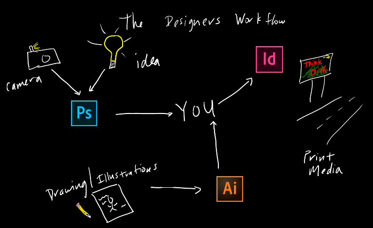
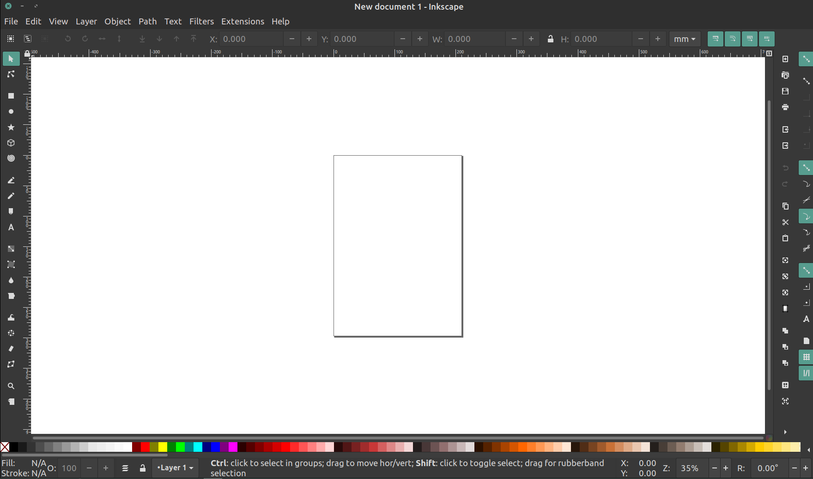
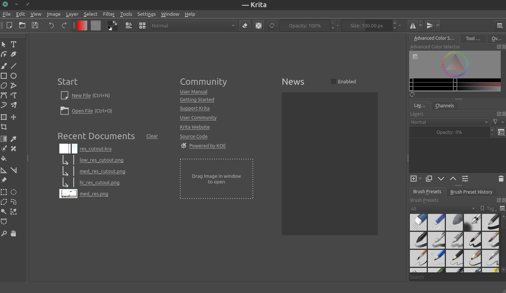
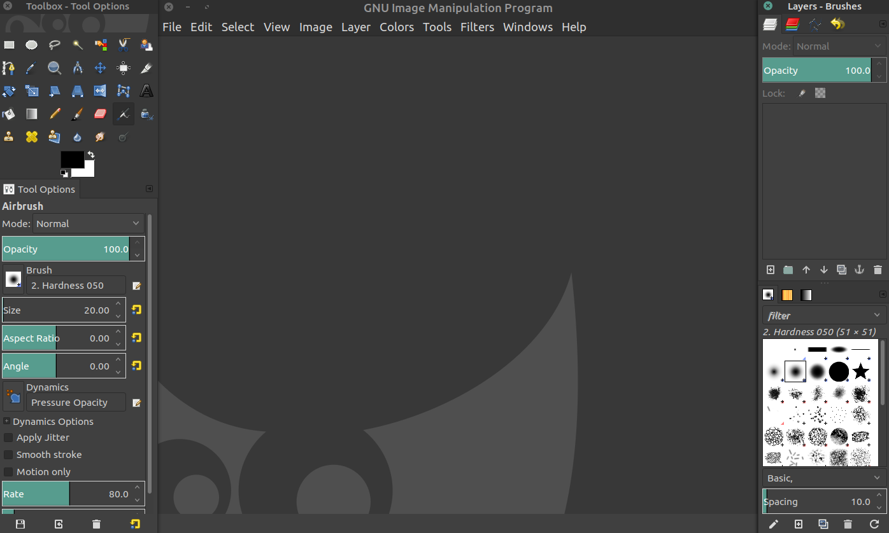

This section will be a run-down of some examples of my own personal use-cases for image creation. I cannot endorse certain programs over others from a techincal perspective of optimization, performance, or professional technique. However, these programs have specific usage areas, and my own biases will come through. Mandatory shout out to my friend and lab mate, Dr. Monica Keiko Lieng, who helped me with finding my "workflow".

*<u>Disclaimer:</u>* I have received many of these programs free through my university at one point or another. The free and open source alternatives are in the last section.

## Learning Objectives

- Participants will list several 1) paid and 2) free programs made for graphics
- Participants will describe the workflow for Adobe Creative Cloud

## The workflow

I have spent many years working exclusively with Adobe Photoshop. In fact, it was the first program that I was introdcued to many years ago when I was in high school. We had a one semester class focused around computer and information technology. Our teacher had studied computer graphics in college and he emphasized two very important things:

1. How to use Adobe Photoshop for image manipulation and to create a magazine print cover
2. If you don't know how to do something, "google it"

While learning how to use Photoshop was definitely more directly relevant to the class, learning the power of using a search engine for design problems is probably one that I have refined over and over again since my first "[yahooligans](https://en.wikipedia.org/wiki/Yahoo!_Kids)" search back in 1999. Either way, one *important* lesson that I missed, or might have never heard in that classroom of 35 hyperactive high school students with access to the entire internet was:

- Professional designers and illustrators were using a variety of programs to do their work, not just Photoshop

It wasn't until much later that I understoond design better, and knew how Adobe had capitalized on the working professionals to offer one consistent experience which merged into the now discontinued Adobe Creative Suite in favor of the Adobe Creative Cloud subscription service. But of course access to these programs were behind a huge paywall. And luckily I was able to use these programs with my university license access.

Because of this, and wide avaiability of online tutorials, my workflow became this:

This had 3 basic working steps:

1. Edit the image from the real word using Photoshop
2. Create any illustrations that you will use using Illustrator
3. Put them together with text for print using InDesign

And for the most part of my image creating career, this was the preferred method for my work. I recently began to switch over to free and open source programs for many things. This included a shift in using free programming [IDE](https://en.wikipedia.org/wiki/Integrated_development_environment)s to generate images. I previously used MatLab for all my graphs and plotting, but now I have shifted to the Python programming language for this. So, in this vein, I might as well also begin using these free programs to generate my images.

## The Programs

The follow list of programs are taken from my limited experiences switching out of paid subscriptions. They are not comprehensive, but showcase some good ones!

### Free and open source

- [Inkscape](https://inkscape.org) -- The first one on my list is of course Inkscape, which has a huge community and is completely cross-platform (Windows, OSX, and Linux).

  

- [Krita](https://krita.org) -- This one is fairly new to me, but I really enjoy it. Mainly used by artists for drawing, but it has a really nice and easy to use interface. Cross platform as well.

  

- [GIMP](https://gimp.org) -- A tried and true classic program. I've used this one in the past but didn't know I was using it. It has a lot of features that are accessible for beginners.

  

### Paid programs

- Microsoft Office PowerPoint -- This one is a bit of a contradiction. I was vehemently opposed to using any MS Office product for image production. But some nice features have been creeping in recently, and they can now export high quality image files. Give it a shot for quick and dirty images.
- Adobe Creative Cloud -- While I would support this more if it was affordable, for the beginner, it might be too overwhelming at first. However, these are still the industry standard, if you can get your hands on a license, give them a try.
- Corel -- At one point, CorelDRAW was one of the biggest image manipulating programs used. But recently, has not been as popular and widespread. In anycase, this is still a good paid program to try, if you can find a license.

## Additional Resources

Others have looked into many aspects of programs that can help you make a decision with comments about performanace and more specific use cases. There are some articles that you can read for more complete suggestions.

- [EPS vs SVG](https://www.educba.com/svg-vs-eps/) All about what vector image format you should use for your images
- [Exporting High Res PowerPoint](https://www.slidecow.com/powerpoint-tutorials/export-high-resolution-high-quality-images-powerpoint/) Now Microsoft Office has much more capability and can help when you are in a bind
- [Which program?](https://medium.com/@inkbotdesign/top-8-free-open-source-tools-for-graphic-designers-3c34768e2c86) If you want a short, slightly more technical description of some of the free programs
