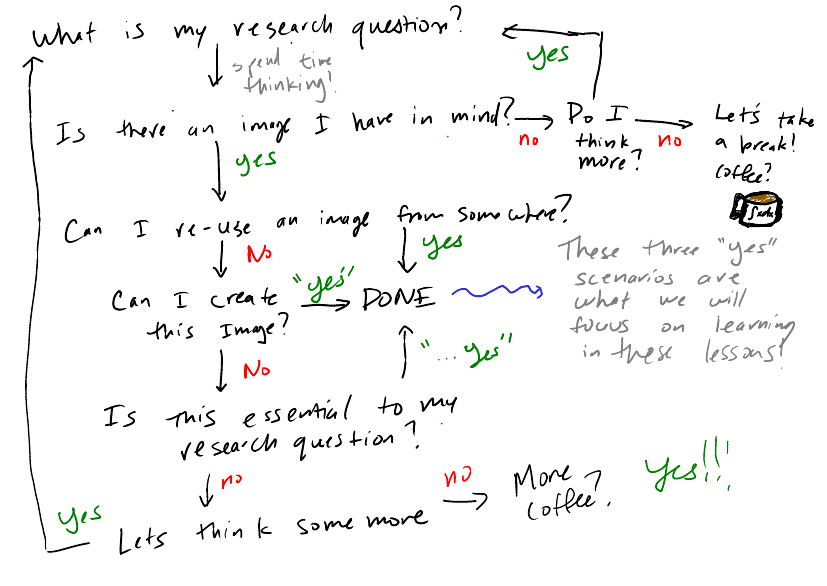
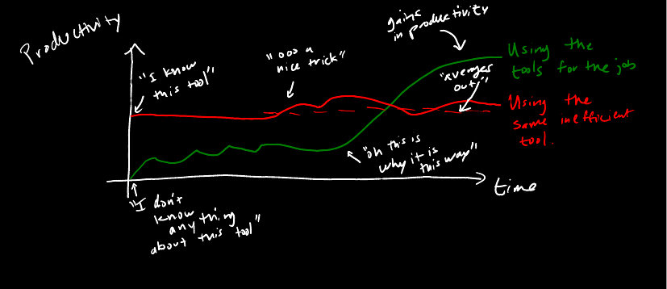

Now that we have enough information about the technical aspects of images and some programs, we now can turn to actually developing an image for research. In this lesson, we will cover the two main portions of actually creating an image. First we must determine our message and image pair, then we must determine if the time we have allotted for creating an image will be feasible and necessary. 

## Learning Objectives

- Participants will outline the research image/message they want to convey
- Participants will list several programs for 1) image manipulation and 2) vector graphics
- Participants will evaluate the needs for their image and pair that with a program

## Genesis of an image

When I sit around thinking about image creation, I have already spent a good deal of time thinking: "What is the message that I want to convey?". The once I figure out the message, I turn to image creation as an additionally means of amplifying this message. 

- Do I need an image to show this? *The answer is usually always, yes.*
- Is there another image that exists? *The answer is usually always, no* 

Based on my answers, I would always be creating original images! But because we are all suffering from having only a 24-hour day, I have to decide where to spend my time wisely. So then I contemplate the same questions as above with more discriminating words:

- How important is it for this image to convey this specific message that is essential to my research message?
- Is there an image that already exists that can help me convey this message, and is it available for reuse?

The answer to these pointed questions then move me to thinking optimally about my time. The beauty of this process is that it can be iterative, and it does not need to occur all at once. So you can decide as you go, but at the end of this process, of optimizing the time and the message you want to convey, you can come up with a suitable plan to create your image. For some of you that like to have a step-by-step list, consider the following flow chart:

## Time and Tools

When you have decided on creating a message, now you must evaluate how much time you have, and balance that with what you want to convey. We all want, well maybe I only want, to create textbook and publication quality images. But there are times when we cannot have everything that we want.  And in particular, after [lesson 03](lesson-03.html) introduced us to various programs, sometimes we just cannot take the time to learn a new program in the middle of writing a new grant application. Lets evaluate if you have time:

|                     | I dont want to learn a new program                           | I want to learn a new program                                |
| ------------------- | ------------------------------------------------------------ | ------------------------------------------------------------ |
| I have no time      | Start using Microsoft Powerpoint, chances you are already using it and know how | Why are you trying to learn a program, do not procrastinate. If you do, try Inkscape |
| I have some time    | Maybe you should just stick to what you already know and use Microsoft PowerPoint | This is a perfect opportunity to learn a beginner program. Try out Inkscape for vector graphics or Krita for a quick sketch |
| I have all the time | Once more, if you know PowerPoint, then keep going           | Now you can try to learn the top 3: Inkscape, GIMP, and  Krita. But if you have access to Adobe CC, then try out the [workflow](lesson-03.html#the-workflow) described in [lesson 3](lesson-03.html). |

As we can see, time is the limiting factor here. But also one should consider if the tool you need will work for the task you want to accomplish. We have previously talked about how I used Adobe Photoshop for everything. I do not think that was the right tool for the job, and I was less productive with it in the long term, compared to learning a new program. But as technology and tools improve and become more versatile, adapting to the right tool for the job can help.

So lets reevaluate what tools we use for the job:

| Complexity                 | Drawing                            | Vector Images     | Image Manipulation        | Text-heavy                    | Data Graphing and Plotting                                   |
| -------------------------- | ---------------------------------- | ----------------- | ------------------------- | ----------------------------- | ------------------------------------------------------------ |
| Easier                     | pen and paper, then scan           | Code SVG          | iPhone filters, Instagram | Microsoft Word and Powerpoint | This is the part in all of my lessons that I will strongly suggest you learn to code. |
| Harder, but more expensive | drawing on a tablet (iPad, Kindle) | Adobe Illustrator | Adobe Photoshop           | Adobe InDesign                |                                                              |
| FREE                       | Krita, Xournal++, GIMP             | GIMP, Inkscape    | GIMP, Krita               | Inkscape                      |                                                              |

I have outlined here some very important aspect that sometimes we have taken for granted: using tools such as writing on a pen and paper, then scanning or taking an image of it can be very powerful. In fact, this is probably the quickest way to get an idea through without much technology. We will revisit doing a written paper drawing, and then using these tools in conjuction in [lesson 5](lesson-05.html).

## Next Steps

Now we have reached the point in these lessons that we will use all the tools and knowledge that we have been learning. Whether you want to convey a trend for a general audience or specific subject graphic that helps amplify your message, we are ready to beginning doing some hand's on learning. The outline for the next lessons will begin with basic building blocks of image creation and editing tools, then culminate with creating a full research image. I recommend going step-by-step during each lesson in order to get the most of the hands-on activity. However, if you are comfortable with most of these tools, and want to just get into the research creation image, then feel free to skip ahead to the last [lesson](lesson-07.html).

- [Lesson 05](lesson-05.html) Working with existing images
- [Lesson 06](lesson-06.html) Creating vector images
- [Lesson 07](lesson-07.html) Putting it all together

But please be reminded about our time commitments...

"Piled Higher and Deeper" by Jorge Cham, www.phdcomics.com

## Image Credits

- [PhD Comic 1060](http://phdcomics.com/comics/archive.php?comicid=1060) by Jorge Cham
- "Workflow" by Carlos A. Ruvalcaba is licensed under  [CC BY-SA 4.0](https://creativecommons.org/licenses/by-sa/4.0/deed.en)
- "Productivity" by Carlos A. Ruvalcaba is licensed under  [CC BY-SA 4.0](https://creativecommons.org/licenses/by-sa/4.0/deed.en)

